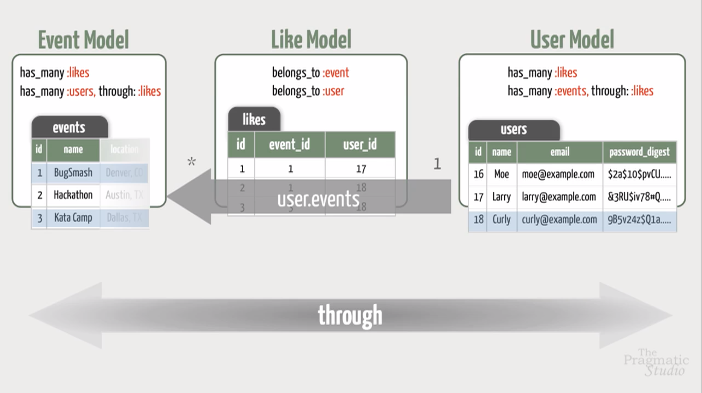

# Ruby on Rails: Level II

## User Accounts: Model

```shell
rails g resource user name email password:digest
rails db:migrate
```

--> Install bcrypt gem

```shell
> u = User.new
 => #<User id: nil, name: nil, email: nil, password_digest: nil, created_at: nil, updated_at: nil>
> u.save
  User Exists (0.5ms)  SELECT  1 AS one FROM "users" WHERE "users"."email" IS NULL LIMIT ?  [["LIMIT", 1]]
 => false
> u.errors.full_messages
 => ["Password can't be blank", "Name can't be blank", "Email can't be blank", "Email is invalid"]
> u.name = "Mike"
 => "Mike"
> u.email = "mike@example.com"
 => "mike@example.com"
> u.password = "secret"
 => "secret"
> u.password_digest
 => "$2a$10$T.sfDKcLksiJvPnn4nfkLOVprOcVBrZsGT9zXUYpWV1XY4nqXhnSi"
> u.password_confirmation = "sss"
 => "sss"
> u.save
  User Exists (0.5ms)  SELECT  1 AS one FROM "users" WHERE LOWER("users"."email") = LOWER(?) LIMIT ?  [["email", "mike@example.com"], ["LIMIT", 1]]
 => false
> u.errors.full_messages
 => ["Password confirmation doesn't match Password"]
> u.password_confirmation = "secret"
 => "secret"
> u.save
  User Exists (0.1ms)  SELECT  1 AS one FROM "users" WHERE LOWER("users"."email") = LOWER(?) LIMIT ?  [["email", "mike@example.com"], ["LIMIT", 1]]
  SQL (0.3ms)  INSERT INTO "users" ("name", "email", "password_digest", "created_at", "updated_at") VALUES (?, ?, ?, ?, ?)  [["name", "Mike"], ["email", "mike@example.com"], ["password_digest", "$2a$10$T.sfDKcLksiJvPnn4nfkLOVprOcVBrZsGT9zXUYpWV1XY4nqXhnSi"], ["created_at", "2018-11-26 11:39:22.734016"], ["updated_at", "2018-11-26 11:39:22.734016"]]
 => true
```

## Sign In: Part I

 ```ruby
 # Add "resources :session" to routes.rb
 Rails.application.routes.draw do
  resource :session

  get "signup" => "users#new"
  resources :users
  root "events#index"
  resources :events do
    resources :registrations
  end
end
 ```

## Authoritation: Part I

```ruby
class UsersController < ApplicationController
  before_action :require_signin, except: [:new, :create]

  ...

end

class ApplicationController < ActionController::Base
  protect_from_forgery with: :exception

  private

  def require_signin
    unless current_user
      redirect_to new_session_url, alert: 'Please sign in first!'
    end
  end

  def current_user
    User.find(session[:user_id]) if session[:user_id]
  end

  helper_method :current_user
end

class ApplicationController < ActionController::Base
  
  ...

  private

  def require_signin
    unless current_user
      redirect_to new_session_url, alert: 'Please sign in first!'
    end
  end

  ...

end
```

## Authoritation: Part II

```ruby
class UsersController < ApplicationController
  before_action :require_signin, except: [:new, :create]
  before_action :require_correct_user, only: [:edit, :update, :destroy]
  
  ...

  private

  def require_correct_user
    @user = User.find(params[:id])
    unless current_user == @user
      redirect_to root_url
    end
  end

  ...

end
```

## Through Associations




## Action-Specific Layout Content

### To put some content in the side bar

```ruby
# show.html.erb --> Sorrodnd the content with "content_for"

...

<% content_for(:side) do %>
  <% if @likers.any? %>
    <h3>Likers</h3>
    <ul>
      <% @likers.each do |user| %>
        <li>
          <%= link_to user.name, user %>
        </li>
      <% end %>
    </ul>
  <% end %>
<% end %>

... 

```

```ruby
# _sidebar.html.erb --> Show the content

...

<%= content_for(:side) %>

...

```

## Scopes


# Custom Routes


```ruby
Rails.application.routes.draw do
  resources :categories
  resource :session
 
  get "signup" => "users#new"
  resources :users
 
  root "events#index"
 
  get "events/past" => "events#index", scope: "past"
  get "events/free" => "events#index", scope: "free"
  
  resources :events do
    resources :registrations
    resources :likes
  end
end
```

```ruby
Rails.application.routes.draw do
  resources :categories
  resource :session

  get 'signup' => 'users#new'
  resources :users

  root 'events#index'

  %w[past free].each do |scope|
    get "events/#{scope}" => 'events#index', scope: scope
  end

  resources :events do
    resources :registrations
    resources :likes
  end
end
```

```ruby
Rails.application.routes.draw do
  resources :categories
  resource :session

  get 'signup' => 'users#new'
  resources :users

  root 'events#index'

  get "events/:scope" => 'events#index'

  resources :events do
    resources :registrations
    resources :likes
  end
end
```

```ruby
Rails.application.routes.draw do
  resources :categories
  resource :session

  get 'signup' => 'users#new'
  resources :users

  root 'events#index'

  get "events/:scope" => 'events#index', constraints: { scope: /past|free/}

  resources :events do
    resources :registrations
    resources :likes
  end
end
```

```ruby
Rails.application.routes.draw do
  resources :categories
  resource :session

  get 'signup' => 'users#new'
  resources :users

  root 'events#index'

  get "events/filter/:scope" => 'events#index'

  resources :events do
    resources :registrations
    resources :likes
  end
end
```
